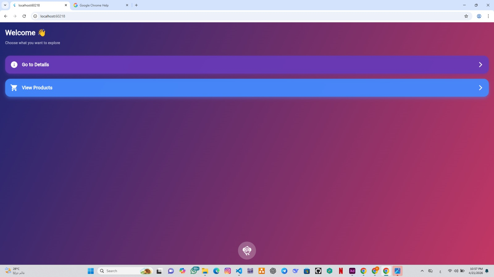
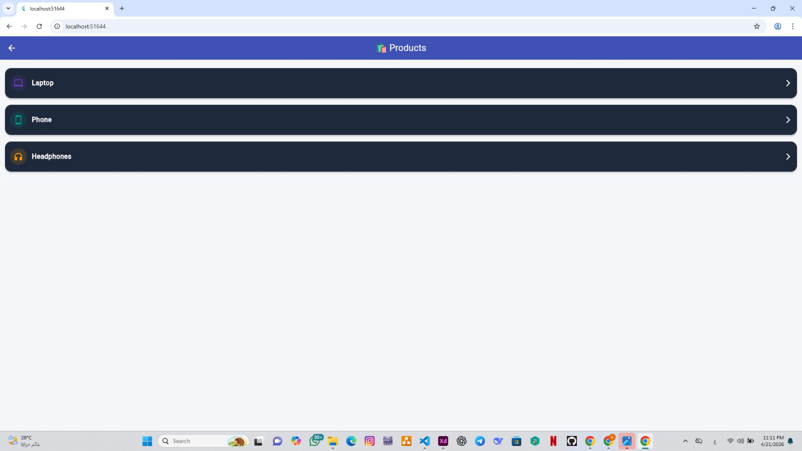
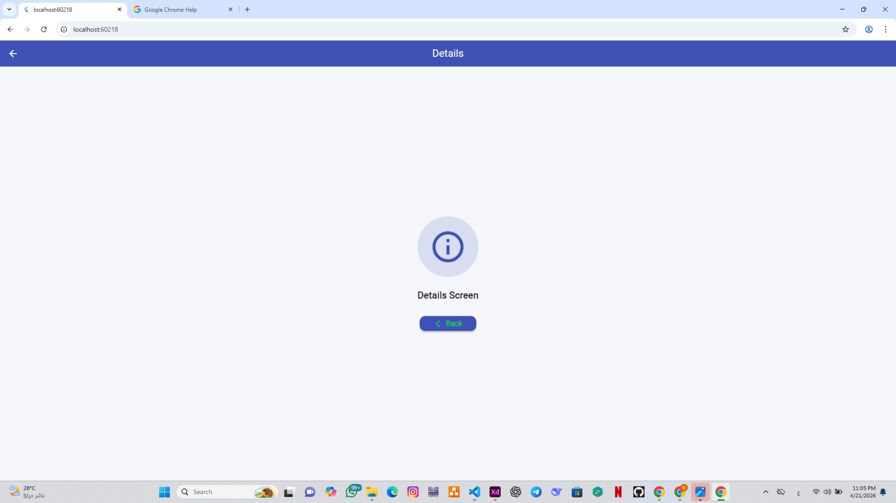
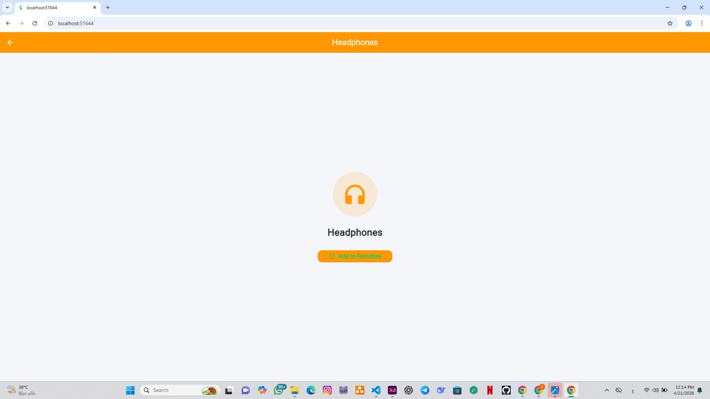

# 🔁 Flutter Navigation Stack

مشروع يوضح كيفية التنقل بين الشاشات باستخدام Navigator في Flutter.

---

## ✨ Features

* التنقل بين عدة شاشات
* استخدام Navigator.push
* الرجوع باستخدام Navigator.pop
* عرض تفاصيل عناصر (Products)

---

## 📸 Screenshots

### 🏠 Home Screen



### 📦 Products Screen



### ℹ️ Details Screen



### 🎧 Headphones Screen



---

## 🛠️ Technologies Used

* Flutter
* Dart

---

## ▶️ How to Run

```bash
flutter pub get
flutter run
```

---

## 📌 Notes

هذا المشروع يشرح:

* Basic Navigation
* Passing between screens
* UI structure في Flutter
